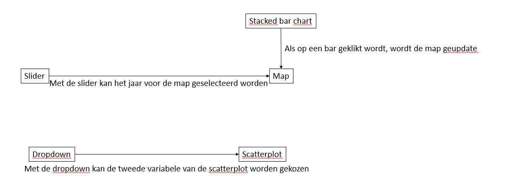

# Design Document

## Data sources
Alle data komt in csv bestanden van de website van het CBS. Deze bestanden staan ook al in de repository. De csv bestanden zal ik omzetten naar json-bestanden. Hiervoor kan ik een programma gebruiken dat ik eerder bij het vak datavisualisaties heb gemaakt. Die moet een klein beetje aangepast worden voor deze bestanden.
* Voor de stacked bar chart wordt de volgende bron gebruikt: https://opendata.cbs.nl/statline/portal.html?_la=nl&_catalog=CBS&tableId=37789ksz&_theme=33
* Voor de plattegrond wordt de volgende data gebruikt:
  * https://opendata.cbs.nl/statline/portal.html?_la=nl&_catalog=CBS&tableId=83450NED&_theme=264
  * https://opendata.cbs.nl/statline/portal.html?_la=nl&_catalog=CBS&tableId=83747NED&_theme=264
  * https://opendata.cbs.nl/statline/portal.html?_la=nl&_catalog=CBS&tableId=83450NED&_theme=264
* Voor de scatterplot wordt de volgende data gebruikt: 
  * https://opendata.cbs.nl/statline/portal.html?_la=nl&_catalog=CBS&tableId=81431ned&_theme=6
  * https://opendata.cbs.nl/statline/portal.html?_la=nl&_catalog=CBS&tableId=84087NED&_theme=221
  * https://opendata.cbs.nl/statline/portal.html?_la=nl&_catalog=CBS&tableId=84114NED&_theme=377
  
## Diagram

## Components
* stacked bar chart: in deze bar chart wordt weergegeven hoeveel uitkeringen er ieder jaar waren en welke uitkeringen dit waren. Hiervoor kan ik de bar chart die ik in het vak datavisualisaties uitbreiden naar een stacked bar chart. Wanneer op een van de laatste drie jaren wordt geklikt wordt de map geupdate.
* map: hierin wordt de verdeling van de bijstandsuitkeringen per gemeente weergegeven. Hiervoor heb ik een databestand nodig met de geografische gegevens van de gemeenten.
* slider: met de slider wordt gekozen van welk jaar de plattegrond getoond moet worden.
* dropdown: in het dropdown menu kan gekozen worden tegenover welke variabele het aantal bijstandsuitkeringen wordt uigezet
* scatterplot: een scatterplot van verschillende economische variabelen en de bijstandsuitkeringen.

## Plugins
* D3-tip
* bootstrap
