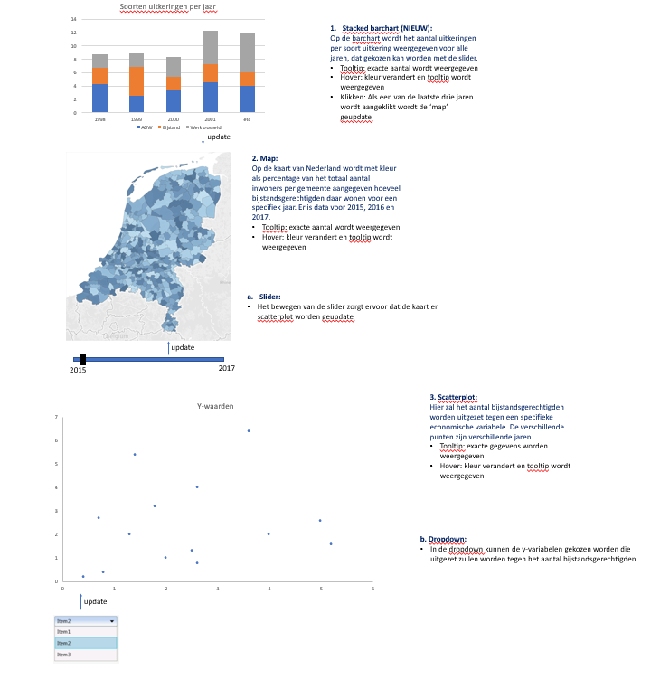

# Ontwikkeling sociale zekerheid in Nederland

## Website
https://veranijmeijer.github.io/Project/index

## Probleem
Er zijn in Nederland veel mensen die een uitkering krijgen. Toch zijn er weinig mensen die weten hoeveel uitkeringen er worden uitgegeven en welke. Er is dus een gebrek aan kennis over de uitkeringen in Nederland. De doelgroep van deze datavisualisatie zijn mensen met interesse in de sociale zekerheid in Nederland en de verdeling van de uitkeringen de afgelopen jaren. Met deze visualisatie zal er meer duidelijkheid komen over uitkeringen in Nederland.

## Oplossing
Met behulp van deze visualisatie wordt duidelijk gemaakt hoeveel uitkeringen er worden uitgegeven en hoe deze uitkeringen verdeeld zijn de afgelopen jaren en door welke factoren dit beïnvloedt wordt.

## Schets

## Main features
* Stacked barchart van de soorten uitkeringen per jaar(MVP)
* Interactieve kaart van Nederand met informatie over de bijstandsgerechtigden per gemeente (MVP)
* Scatterplot waarin economische factoren worden uitgezet tegenover het aantal bijstandsgerechtigden (MVP)
* Slider om een specifiek jaar te selecteren (MVP)
* Dropdown om economische factor te kiezen (MVP)

## Prerequisites
### Data sources
* https://opendata.cbs.nl/statline/portal.html?_la=nl&_catalog=CBS&tableId=37789ksz&_theme=33
* https://opendata.cbs.nl/statline/portal.html?_la=nl&_catalog=CBS&tableId=84066NED&_theme=260
* https://opendata.cbs.nl/statline/portal.html?_la=nl&_catalog=CBS&tableId=84114NED&_theme=377
* https://opendata.cbs.nl/statline/portal.html?_la=nl&_catalog=CBS&tableId=84087NED&_theme=221
* https://opendata.cbs.nl/statline/portal.html?_la=nl&_catalog=CBS&tableId=84165NED&_theme=228

### External components
* D3-tip

### Review
Op de site van het CBS staan ook vele visualisaties van de data, zoals op de volgende pagina: https://www.cbs.nl/nl-nl/nieuws/2018/46/groei-van-het-bbp-vlakt-af.
Op die pagina is een barchart te zien, die ongeveer dezelfde specificaties heeft als de barchart die ik wil maken. Hier kan ik dus een voorbeeld aan nemen en kijken welke onderdelen daarvan ik ook wil gebruiken. Op de rest van de site van het CBS staan nog veel meer voorbeelden van datavisualisaties. Het CBS gebruikt HighCharts voor de visualisatie. Voor mijn project ga ik echter D3 gebruiken.

### Moeilijkste onderdelen
Het lastigste onderdeel van deze datavisualisatie is het koppelen van alle visualisaties aan elkaaar. Dat heb ik alelen in het klein gedaan voor de laatste opdracht van data, dus dat wordt hier wel lastiger.

