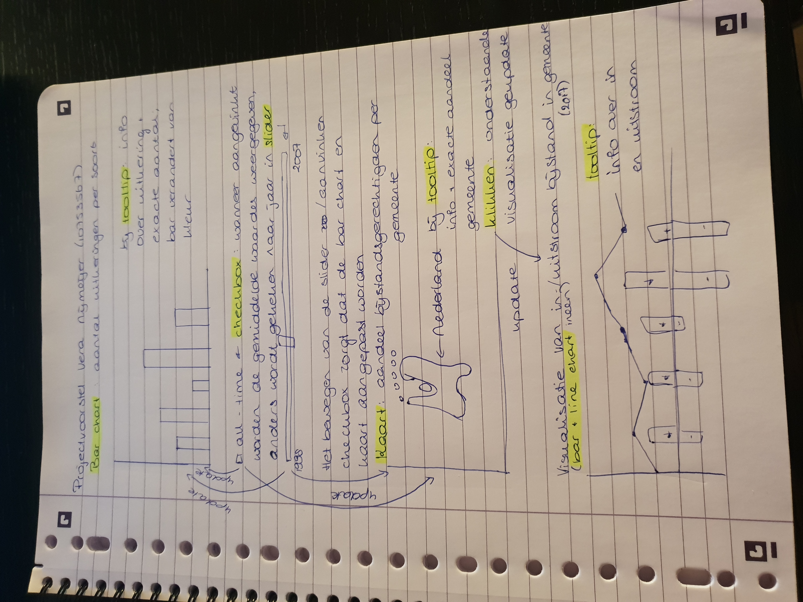

# Projectvoorstel programmeerproject
# Ontwikkeling sociale zekerheid in Nederland

## Probleem
Er zijn in Nederland veel mensen die een uitkering krijgen. Toch zijn er weinig mensen die weten hoeveel uitkeringen er worden uitgegeven en welke. Er is dus een gebrek aan kennis over de uitkeringen in Nederland. De doelgroep van deze datavisualisatie zijn mensen met interesse in de sociale zekerheid in Nederland en de ontwikkeling en verdeling van de uitkeringen de afgelopen jaren. Met deze visualisatie zal er meer duidelijkheid komen over uitkeringen in Nederland.

## Oplossing
Met behulp van deze visualisatie wordt duidelijk gemaakt hoeveel uitkeringen er worden uitgegeven, welke uitkeringen worden uitgegeven en hoe deze verdeling zich ontwikkeld heeft de afgelopen jaren. Vervolgens wordt er ingezoomd op de bijstandsuitkeringen. Hiervan wordt weergegeven hoe deze verdeeld zijn over Nederland en hoe die zijn toe- en afgenomen de laatste drie jaar.

## Schets

## Main features
* Bar chart van de soorten uitkeringen (MVP)
* Interactieve kaart van Nederand met informatie over de bijstandsgerechtigden per gemeente (MVP)
* Bar chart en line chart ineen waarin de instroom en uitstroom van bijstandsgerechtigden per gemeente in 2017 worden gevisualiseerd. (MVP)
* Checkbox om alle jaren in één kaart/bar chart weer te geven (optional)
* Slider om een specifiek jaar te selecteren (MVP)
* Klikken op de kaart waarna in de onderste grafiek de gegevens van de juiste gemeente worden getoond)

## Prerequisites
### Data sources
* https://opendata.cbs.nl/statline/portal.html?_la=nl&_catalog=CBS&tableId=37789ksz&_theme=33
* https://opendata.cbs.nl/statline/portal.html?_la=nl&_catalog=CBS&tableId=84066NED&_theme=260

### External components
* D3-tip

### Review
Op de site van het CBS staan ook vele visualisaties van de data, zoals op de volgende pagina: https://www.cbs.nl/nl-nl/nieuws/2018/46/groei-van-het-bbp-vlakt-af.
Op die pagina is een bar chart te zien, die ongeveer dezelfde specificaties heeft als de bar chart die ik wil maken. Hier kan ik dus een voorbeeld aan nemen en kijken welke onderdelen daarvan ik ook wil gebruiken. Op de rest van de site van het CBS staan nog veel meer voorbeelden van datavisualisaties. Het CBS gebruikt HighCharts voor de visualisatie. Voor mijn project ga ik echter D3 gebruiken.

### Moeilijkste onderdelen
De lastigste onderdelen van deze datavisualisatie zijn het maken van de kaart en het koppelen van alle visualisaties aan elkaaar. Beide onderdelen heb ik nooit eerder gedaan, dus daarvan moet ik nog uitzoeken hoe het werkt.
