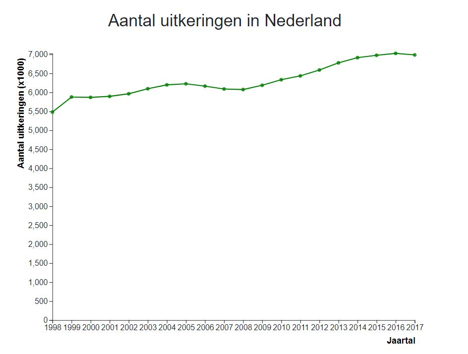

# Ontwikkeling sociale zekerheid in Nederland

## Info
Programmeerproject Minor Programmeren 
Naam: Vera Nijmeijer 
Studentnummer: 10753567 
Website: https://veranijmeijer.github.io/Project/index

## Doel
Er zijn in Nederland veel mensen die een uitkering krijgen. Toch zijn er weinig mensen die weten hoeveel uitkeringen er worden uitgegeven en welke. Er is dus een gebrek aan kennis over de uitkeringen in Nederland. De doelgroep van deze datavisualisatie zijn mensen met interesse in de sociale zekerheid in Nederland en de verdeling van de uitkeringen de afgelopen jaren. Met deze visualisatie zal er meer duidelijkheid komen over uitkeringen in Nederland.

Met behulp van deze visualisatie wordt duidelijk gemaakt hoeveel uitkeringen er worden uitgegeven en hoe deze uitkeringen verdeeld zijn de afgelopen jaren en door welke factoren dit beïnvloedt wordt.

 
## Demonstratie website

### Verhaal
 
Op deze pagina wordt in het kort informatie gegeven over de uitkeringen in Nederland. Daarnaast staat hier ook de uitleg over hoe de site gebruikt kan worden.

### Visualisaties

Op deze pagina staan alle visualisaties van dit project:
1. <b>Linechart</b> 
 
Hierin wordt per jaar (1998-2017) weergegeven hoeveel uitkeringen er in Nederland zijn. Wanneer op één van de jaren wordt geklikt, zullen de piechart en map geupdate worden voor dat specifieke jaar.
2. <b>Piechart</b> 
 
In deze piechart wordt voor een specifiek jaar weergegeven hoe de verschillende soorten uitkeringen verdeeld zijn. Wanneer op één van deze uitkeringen wordt geklikt (in de piechart zelf of de legenda van de piechart), zal er in de linechart een lijn worden toegevoegd voor die specifieke uitkering, die weergeeft hoe het aantal uitkeringen van die uitkering zich ontwikkeld heeft afgelopen jaren. Deze lijn zal dezelfde kleur hebben als deze uitkering in de piechart en legenda heeft. Wanneer nogmaals op dezelfde uitkering wordt geklikt, wordt de lijn weer verwijderd.
3. <b>Slider</b> 
 
Deze slider is een tweede manier om de piechart en map te updaten. Wanneer er op wordt geklikt, zullen de nieuwe piechart en map van dat specifieke jaar worden weergegeven.
4. <b>Map</b> 
 
Deze kaart kan twee verschillende dingen weergegeven over de gemeentes in Nederland, namelijk de dichtheid van het aantal bijstandsuitkeringen of het absolute aantal bijstandsuitkeringen. De kleuren corresponderen met de legenda die ernaast staat. Voor de kaart is alleen data beschikbaar voor 2015, 2016 en 2017. Wanneer één van de andere jaren wordt geselecteerd, blijft de voorgaande kaart zichtbaar en komt er een melding die dit ook aangeeft.
5. <b>Radio buttons</b> 
 
Wanneer één van de radiobuttons wordt aangeklikt, zal de kaart worden geupdate voor de soort die wordt gekozen (dichtheid/absolute aantal).

## Info over repository
De repository is als volgt opgebouwd:
* doc: in deze map staan alle foto's die gebruikt worden in DESIGN.md, PROPOSAL.md en REPORT.md
* files: in deze map staan alle benodigde bestanden voor het project, ondergedeeld in vijf mappen:
  * css
  * data (json/csv)
  * html
  * javascript
  * python
* DESIGN.md: in dit bestand staat uitgelegd wat het technische design van het project was
* index.html: de startpagina van de website
* LICENSE: MIT licensie
* PROCESS.md: hierin staat een beschrijving per dag van het proces afgelopen 4 weken
* PROPOSAL.md: het oorspronkelijke plan voor het project
* README.md: dit bestand
* REPORT.md: eindverslag over het project
* STYLE.md: de styleguide

## Bronnen voor code
### Tooltip
De tooltip is gebaseerd op [bl.ocks.org](http://bl.ocks.org/Caged/6476579).

### Map
De kleuren van de map zijn afkomstig van [ColorBrewer](http://colorbrewer2.org/?type=diverging&scheme=RdYlGn&n=9).

De map is gebaseerd op [bl.ocks.org](http://bl.ocks.org/micahstubbs/8e15870eb432a21f0bc4d3d527b2d14f).

### Linechart
De linechart is gebaseerd op [Dashing D3.js](https://www.dashingd3js.com/svg-paths-and-d3js).

### Piechart
De kleuren van de piechart zijn afkomstig van [Sasha Trubetskoy](https://sashat.me/2017/01/11/list-of-20-simple-distinct-colors/).

De piechart is gebaseerd op [Crypters Infotech](https://www.youtube.com/watch?v=P8KNr0pDqio).

### Radio buttons
De radio buttons zijn gebaseerd op [bl.ocks.org](https://bl.ocks.org/denjn5/3b74baf5edc4ac93d5e487136481c601).

### Slider
De slider is gebaseerd op [bl.ocks.org](https://bl.ocks.org/johnwalley/e1d256b81e51da68f7feb632a53c3518).

## Bronnen voor data
### Afbeelding homepage
[Expatica](https://www.expatica.com/pt/employment/employment-law/minimum-wage-in-portugal-a-guide-to-average-salary-in-portugal-927429/)
### Barchart en piechart
[CBS, Sociale zekerheid: kerncijfers ](https://opendata.cbs.nl/statline/portal.html?_la=nl&_catalog=CBS&tableId=37789ksz&_theme=33)
### Map
* [CBS, Sociale zekerheid: gemeenten 2015](https://opendata.cbs.nl/statline/portal.html?_la=nl&_catalog=CBS&tableId=83450NED&_theme=264)
* [CBS, Sociale zekerheid: gemeenten 2016](https://opendata.cbs.nl/statline/portal.html?_la=nl&_catalog=CBS&tableId=83747NED&_theme=264)
* [CBS, Sociale zekerheid: gemeenten 2017](https://opendata.cbs.nl/statline/portal.html?_la=nl&_catalog=CBS&tableId=84066NED&_theme=264)

Gemeenteplattegronden
* [2015](https://raw.githubusercontent.com/cartomap/nl/master/wgs84/gemeente_2015.geojson)
* [2016](https://raw.githubusercontent.com/cartomap/nl/master/wgs84/gemeente_2016.geojson)
* [2017](https://raw.githubusercontent.com/cartomap/nl/master/wgs84/gemeente_2017.geojson)

## Plugins
* D3, license: [BSD 3-Clause "New" or "Revised" License](https://github.com/d3/d3/blob/master/LICENSE)
* D3 Simple Slider
* D3 Tooltip
* Bootstrap
* jQuery, MIT License
* Popper

<i>
This project is licensed under the terms of the MIT license. 
Vera Nijmeijer, 2019
</i>

