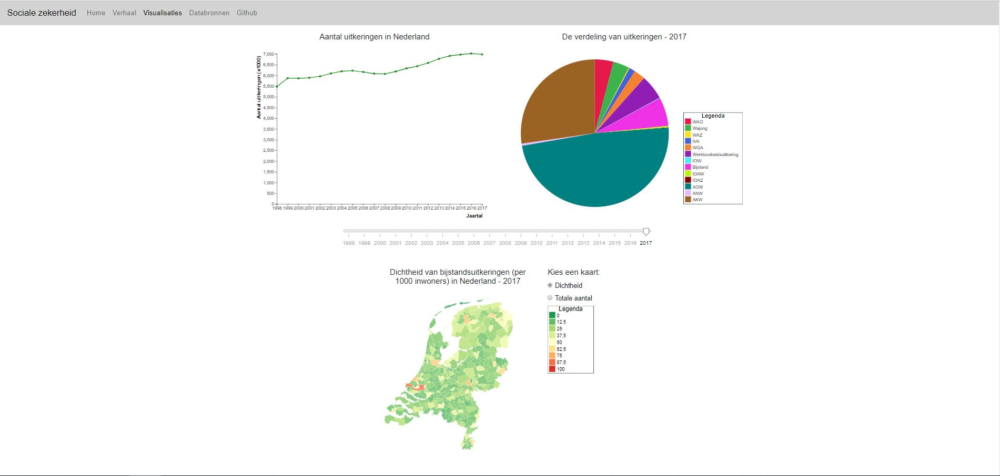

# Report Programmeerproject - sociale zekerheid in Nederland
## Doel
Er zijn in Nederland veel mensen die een uitkering krijgen. Toch zijn er weinig mensen die weten hoeveel uitkeringen er worden uitgegeven en welke. Er is dus een gebrek aan kennis over de uitkeringen in Nederland. Met behulp van deze visualisatie wordt duidelijk gemaakt hoeveel uitkeringen er worden uitgegeven en hoe deze uitkeringen verdeeld zijn de afgelopen jaren en door welke factoren dit beïnvloedt wordt.

## Design
### Globaal overzicht website
De visualisatie op de website bestaat uit vijf onderdelen:
* Linechart: Hier wordt het aantal uitkeringen in Nederland weergegeven. Wanneer je er met de muis overheen gaat, komt er een tooltip en als je erop klikt, worden de piechart en map geupdate.
* Piechart: Hier is de verdeling van de uitkeringen te zien voor een specifiek jaar. Wanneer je er met de muis overheen gaat, komt er een tooltip en als je erop klikt wordt er een lijn toegevoegd aan de linechart voor die specifieke uitkering. Dit kan ook door in de legenda op het blokje van een uitkering te klikken.
* Slider: Met de slider kan een jaartal geselecteerd worden en dan wordt de piechart en map geupdate voor dat jaar.
* Map: In de map kunnen twee dingen worden weergegeven voor de gemeentes in Nederland: de dichtheid van bijstandsuitkeringen of het totale aantal bijstandsuitkeringen. Wanneer je er met de muis overheen gaat, komt er een tooltip.
* Radiobuttons: Met de radiobuttons kan gekozen worden tussen de dichtheid van bijstandsuitkeringen of het absolute aantal. Als hier op wordt geklikt, wordt de map geupdate.

### Bestanden en functies
#### Data
* csv: in deze map staan de csv bestanden, zoals die afkomstig zijn van de site van het CBS. Deze data is gebruikt voor het maken van de visualisaties:
  * gemeente_2015.csv
  * gemeente_2016.csv
  * gemeente_2017.csv
  * social_security.csv
* json: de eerste 4 bestanden in deze map, zijn de bestanden van het CBS nadat ze zijn omgezet naar json bestanden (met behulp van de bestanden [csv2json-linechart.py](#Python) en [csv2json-map.py](#Python).
  * gemeente_2015.json
  * gemeente_2016.json
  * gemeente_2017.json
  * social_security.json

#### HTML

#### JavaScript

#### Python

#### CSS
